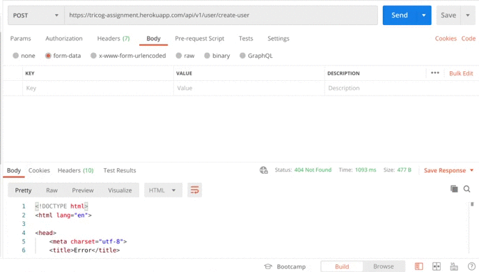

# User Registration and Login

# Preview



# Various Functionality

1. Creating User.
2. Login User.
3. Getting User Profile.

# Techstack

### Node JS (API), MySQL

### API Hosted Link :- https://tricog-assignment.herokuapp.com/api/v1

# Instructions to install

1. Clone this repository from https://github.com/dheerajk7/tricog-health-assignment.git .
2. Install NPM if you have not installed yet.
3. Go to project directory and run these commands

   #### To install node Modules

   ```
   npm install
   ```

   #### To run project

   ```
   npm start
   ```

4. Go and check at http://localhost:8000/api/v1.

# Routes

1. `/user/create-user` -> To create New User.

   ```
   Fields Needed to Create New User :-
   1. email
   2. first_name
   3. PAN_number
   4. date_of_birth
   5. gender
   6. password
   7. profile_image
   ```

2. `/authentication/create-session` -> To login a user and generate JWT token for authentication.

   ```
   Fields Needed to Login User :-
   1. email
   2. password
   ```

3. `/user/profile` -> To get profile of logged in user. We need to pass JWT token for authentication while calling these endpoint.

# Directory Structure

`/` - all node API app files <br>
`/config` - all configuration files <br>
`/controllers`- all controllers files <br>
`/models` - all models files <br>
`/routes` - all routes files <br>
`/services` - all external services file like amazon aws s3 <br>

---
